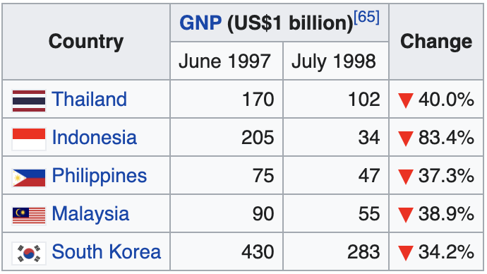

```{r setup, include=FALSE}
knitr::opts_chunk$set(echo = FALSE,message=F,warning=F)
```

## Roadmap

- Motivation
  - Systemic Shock Propagation
  - Systemic Shock Mitigation
- Non-empirical Model
  - Trade networks
  - Frictional Shocks, and min-cost flow
- Empirical Implementation
  - Desired use of data
  - Data preview
  
## Motivation

- Shocks originating from a single country are rarely felt only domestically 
- We seek to model the "domino effect" of recessions. 



## Applications

### Descriptive 
- Systemic risk estimation 
  - Federal Reserve Bank Monitoring
  
### Prescriptive
- Domestic Protection
  - US takes action to minimize domestic impacts of a foreign recession
- System Redesign
  - European Central Bank redesigning tradeflows to prevent systemic shocks

## Model
- Economy of $N$ firms (countries, banks, etc.).
  - Individual firm denoted $a_n$
- Every $a_i$ is connected to every other 
- Let $t_{i,j}$ be the capacity (trade) from $a_i$ to $a_j$

```{r,echo=F}
library(tidygraph)

# Libraries ---------------------------------------------------------------
library(visNetwork)
library(geomnet)
library(igraph)


nodes <- data.frame(id=c("France","Italy","Germany","Switzerland"),label=c("France","Italy","Germany","Switzerland"))
edges <- data.frame(
  from=c("France","France","Italy","Italy","Germany","Germany","Switzerland","Switzerland","Switzerland"),
  to=c("Italy","Germany","France","Germany","France","Italy","Germany","France","Italy"),
  width=c(10,5,4,1,4,3,.5,.5,.5)
  )

# graph <- graph_from_data_frame(edges, directed = F)
# https://www.r-bloggers.com/2019/06/interactive-network-visualization-with-r/
```

## Sample Network

:::: {.columns}
::: {.column width="60%"}
```{r,fig.align='center'}
nodes <- data.frame(id=c("France","Italy","Germany","Switzerland"),label=c("France","Italy","Germany","Switzerland"))
edges <- data.frame(
  from=c("France","France","Italy","Italy","Germany","Germany","Switzerland","Switzerland","Switzerland"),
  to=c("Italy","Germany","France","Germany","France","Italy","Germany","France","Italy"),
  width=c(10,5,4,1,4,3,.5,.5,.5)
  )

# graph <- graph_from_data_frame(edges, directed = F)
# https://www.r-bloggers.com/2019/06/interactive-network-visualization-with-r/
visNetwork(nodes, edges) %>%
 visEdges(arrows = 'to', scaling = list(min = 4, max = 10),color = list( highlight = "#ffd1dc"))
```
:::
::: {.column width="40%"}
- Let each arrow represent exports from one country to another. 
  - The size of each arrow would represent the size of exports. 
  - Any forward arrow implies the destination imports the same quantity.
- A protectionist economy like Switzerland would only have significant export arrows.
- Note that  Note how a shock to Switzerland would have an effect on other economies, but a shock to another country would not affect Switzerland. 
:::
::::

## Modelling systemic shock

- Consider a shock to $a_i$ of magnitude $\sigma_i$
- We perform a min-cost flow algorithm with $a_i$ as the sink
  - The minimum required flow is $\sigma_i$
- What are the costs?
  - Cost inversely proportional to quantity imported
    - eg. shock in $a_1$, the cost of going from $a_2$ to $a_1$ $\propto \frac{1}{t_{1,2}}$
  - This means that an arrow going one way in the diagram above goes the other way in shock propagation
  - example on next slide
- What are the interior capacities?
  - Idea 1:
    - If $x\%$ of $a_i$'s exports are to $a_j$, $a_j$ cannot receive more than $x\%\sigma_i$
  - Idea 2:
    - If $x\%$ of $a_j$'s imports are from $a_i$, $a_j$ cannot receive more than $x\%\sigma_i$
  
## Shock Example
:::: {.columns}
::: {.column width="60%"}
```{r,fig.align='center'}
nodes <- data.frame(id=c("France","Italy","Germany","Switzerland"),label=c("France","Italy","Germany","Switzerland"))
edges <- data.frame(
  from=c("France","France","Italy","Italy","Germany","Germany","Switzerland","Switzerland","Switzerland"),
  to=c("Italy","Germany","France","Germany","France","Italy","Germany","France","Italy"),
  width=c(10,5,4,1,4,3,.5,.5,.5)
  )

# graph <- graph_from_data_frame(edges, directed = F)
# https://www.r-bloggers.com/2019/06/interactive-network-visualization-with-r/
visNetwork(nodes, edges) %>%
 visEdges(arrows = 'to', scaling = list(min = 4, max = 10),color = list( highlight = "#ffd1dc"))
```
:::
::: {.column width="40%"}
```{r,fig.align='center'}
nodes <- data.frame(id=c("France","Italy","Germany","Switzerland","Source"),label=c("France","Italy","Germany","Switzerland","Source"))
edges <- data.frame(
  from=c("France","France","Italy","Italy","Germany","Germany","Switzerland","Switzerland","Switzerland","Italy","Germany","France"),
  to=c("Italy","Germany","France","Germany","France","Italy","Germany","France","Italy","Source","Source","Source"),
  width=c(10,5,4,1,4,3,.5,.5,.5,1,1,1)
  )

# graph <- graph_from_data_frame(edges, directed = F)
# https://www.r-bloggers.com/2019/06/interactive-network-visualization-with-r/
visNetwork(nodes, edges) %>%
 visEdges(arrows = 'from', scaling = list(min = 4, max = 10),color = list( highlight = "#ffd1dc"))
```
:::
::::

## Why this way?

- You can't really start from the place where the shock occurs and follow it a sink (as far as I can tell)
  - Because what would the capacities mean? 
  - The $\sigma_n$ would not be well defined because it would be the size of the system shock, not domestic shock
- This way we can have the capacities on paths from the source to the non-shock countries limited to a finite value
  - That is the algorithm doesn't try to send the entire shock through one path
    - But what should those capacities be?

## TBDs

- How to deal with capacities, like what are they both in the model and in real life?
  - What capacity from source to other points?
- Under the desired capacities model, is it possible for a non-originating country to receive more than $\sigma$
  - I don't think so, how could we make this happen?

## Emprical Implementation

### Desired use of data

We wish take data about how "connected" each economic entity is to every other economic entity in a system. Easiest example, how much trade from each country to every other country. This gives us exactly the network we have above.

Ideally we could apply the above framework to examine the fragility in certain sector before a recession and see if the estimated effects of a shock are matched. For example, we could look at the network for 1996 Thailand and estimate if a downturn there would spread to the countries it did during the Asian Financial Crisis.

## Empirical Implementation

### The data we actually have

Here's a random data sample:
```{r read and head data}
d <- 
  data.table::fread("/Users/aarongraybill/Downloads/Trade_DetailedTradeMatrix_E_All_Data/Trade_DetailedTradeMatrix_E_All_Data.csv",showProgress=T)

set.seed(3.14)
sample_row <- 
  sample(nrow(d),10)
knitr::kable(d[sample_row,])
```

## Discussion and conclusion

- That's a lot of data (1.42 Gb .csv!) that we need to aggregate/filter in a meaningful way.
  - So many `NA`s, what to do? Do we even have complete network
    - Safe to assume `NA` means no trade? bc there are 0s elsewhere?

- The model above was just a jumping off point that we need to iron out
  - How to apply lin-opt to "unwanted" flow